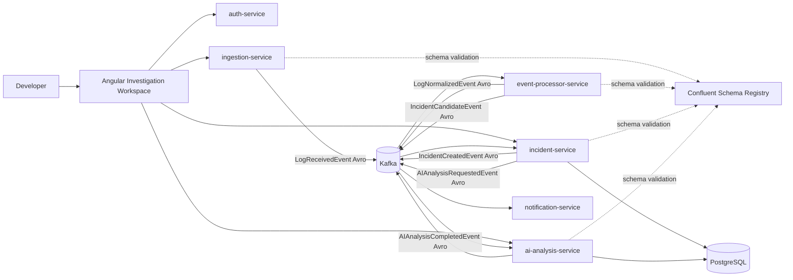
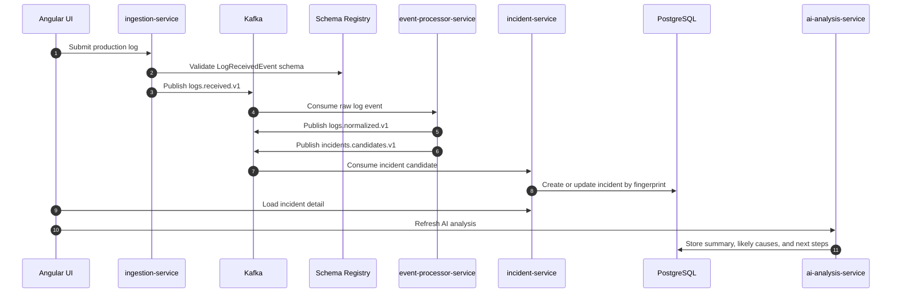
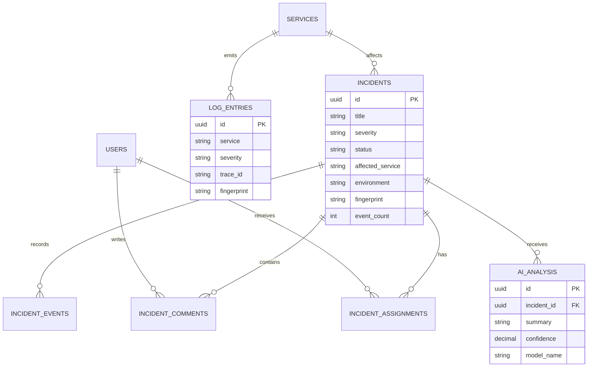

# Incident Platform AI

A distributed incident investigation platform that ingests production logs, processes them through Kafka with Avro contracts, groups related failures into incidents, and gives developers an AI-assisted workspace for diagnosis.

The project is built as a realistic engineering MVP: multiple Spring Boot services, Kafka event choreography, Confluent Schema Registry, PostgreSQL persistence, JWT authentication, an Angular investigation UI, Docker Compose for local execution, and Kubernetes manifests for deployment readiness.

## Product Preview

The Angular application opens directly into the investigation workspace. Developers can filter active incidents, inspect grouped failures, review metadata, change status, follow the timeline, and refresh AI analysis.


Kafka UI is included in the local environment so the event backbone can be inspected while the demo is running.


Schema Registry exposes the registered Avro subjects for the platform's Kafka contracts.


The full stack runs locally with Docker Compose.


## Key Features

- REST log ingestion for single log events and batch/file uploads.
- Kafka-based event processing with Avro serialization.
- Confluent Schema Registry integration for event contract validation.
- Deterministic log fingerprinting for incident grouping.
- Incident lifecycle APIs for status, assignment, comments, and timeline.
- AI analysis workflow with summaries, likely causes, next steps, confidence, and model metadata.
- JWT authentication with `ADMIN` and `DEVELOPER` roles.
- Angular dashboard for incident investigation and log search.
- PostgreSQL persistence with Flyway migrations and seeded demo data.
- Docker Compose local runtime and Kubernetes deployment manifests.

## Tech Stack

| Layer | Technology |
| --- | --- |
| Backend | Java 17, Spring Boot 3 |
| Messaging | Kafka |
| Contracts | Avro, Confluent Schema Registry |
| Database | PostgreSQL, Flyway |
| Frontend | Angular |
| Auth | JWT |
| Local runtime | Docker Compose |
| Deployment | Kubernetes manifests |

## Architecture



## Event Flow



## Data Model



## Kafka Contracts

All Kafka payloads are Avro messages generated into Java classes during the Maven build.

| Topic | Avro event |
| --- | --- |
| `logs.received.v1` | `LogReceivedEvent` |
| `logs.normalized.v1` | `LogNormalizedEvent` |
| `incidents.candidates.v1` | `IncidentCandidateEvent` |
| `incidents.created.v1` | `IncidentCreatedEvent` |
| `ai.analysis.requested.v1` | `AIAnalysisRequestedEvent` |
| `ai.analysis.completed.v1` | `AIAnalysisCompletedEvent` |

## Repository Structure

```text
backend/
  common-events/           Avro schemas and generated Java event classes
  common-security/         Shared JWT helpers and security configuration
  ingestion-service/       REST and file/batch log ingestion
  event-processor-service/ Kafka log normalization and incident candidate detection
  incident-service/        Incident persistence and workflow APIs
  ai-analysis-service/     Pluggable AI analysis worker and APIs
  notification-service/    Notification event consumer
  auth-service/            JWT login API
frontend/                  Angular investigation workspace
deploy/k8s/                Kubernetes deployment manifests
docs/assets/               README demo visuals
docker-compose.yml         Local platform runtime
```

## Kubernetes Deployment

Kubernetes manifests are available in [`deploy/k8s`](deploy/k8s). They include namespace/config/secrets, Spring Boot service deployments, frontend deployment, ingress routes, HPAs, PostgreSQL for development, and dev Kafka/Schema Registry resources.

The Compose setup is the primary verified local runtime. The Kubernetes files are deployment-readiness manifests intended for local cluster experimentation or as a base for a production deployment that replaces PostgreSQL, Kafka, and Schema Registry with managed services.

```powershell
kubectl apply -k deploy/k8s
```

## Running Locally

Start the full platform:

```powershell
docker compose up -d --build
```

Open the UI:

```text
http://localhost:4200
```

Demo account:

```text
email: dev@example.com
password: password
```

Useful local services:

| Service | URL | Purpose |
| --- | --- | --- |
| Angular UI | `http://localhost:4200` | Investigation dashboard |
| Kafka UI | `http://localhost:8090` | Topic and message inspection |
| Schema Registry | `http://localhost:8088/subjects` | Registered Avro subjects |
| Auth API | `http://localhost:8086` | JWT login |
| Ingestion API | `http://localhost:8081` | Log ingestion |
| Incident API | `http://localhost:8083` | Incident workflow |
| AI Analysis API | `http://localhost:8084` | AI analysis refresh |

## API Example

Login:

```powershell
curl -X POST http://localhost:8086/api/auth/login `
  -H "Content-Type: application/json" `
  -d "{\"email\":\"dev@example.com\",\"password\":\"password\"}"
```

Ingest a log:

```powershell
curl -X POST http://localhost:8081/api/logs `
  -H "Content-Type: application/json" `
  -H "Authorization: Bearer <token>" `
  -d "{\"application\":\"checkout-api\",\"environment\":\"prod\",\"severity\":\"ERROR\",\"message\":\"PaymentProviderTimeoutException order 42 failed\"}"
```

List incidents:

```powershell
curl http://localhost:8083/api/incidents -H "Authorization: Bearer <token>"
```

## Verification

Backend tests:

```powershell
cd backend
mvn test
```

Frontend build:

```powershell
cd frontend
npm install
npm run build
```
