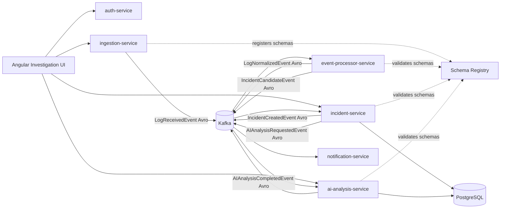

# Incident Platform AI

MVP distributed platform for ingesting logs, processing Kafka events with Avro and Schema Registry, storing incidents in PostgreSQL, and helping developers investigate production issues with AI-assisted analysis.

This project is designed as a portfolio-ready system: small enough to run locally, but structured like a real production platform with service boundaries, event contracts, database migrations, Docker, and Kubernetes manifests.

## Stack

- Java 17, Spring Boot 3
- Kafka, Confluent Schema Registry, Avro
- PostgreSQL, Flyway
- Angular
- Docker Compose
- Kubernetes manifests

## Repository Layout

```text
backend/
  pom.xml
  common-events/          Avro schemas and generated Java event classes
  common-security/        Shared JWT helpers and security configuration
  ingestion-service/      REST and file/batch log ingestion
  event-processor-service Kafka log normalization and incident candidate detection
  incident-service/       Incident persistence and workflow APIs
  ai-analysis-service/    Pluggable AI analysis worker and APIs
  notification-service/   Notification event consumer
  auth-service/           JWT login API
frontend/                 Angular investigation workspace
deploy/k8s/               Kubernetes deployment manifests
docker-compose.yml        Local platform runtime
```

## Architecture Overview



## Local Development

1. Copy `.env.example` to `.env` and adjust values if needed.
2. Start infrastructure and services:

```powershell
docker compose up --build
```

3. Open the frontend at `http://localhost:4200`.
4. Login with the seeded demo user:

```text
email: dev@example.com
password: password
```

5. Click **Send demo error log** in the UI. The log moves through Kafka, becomes an incident candidate, is stored as an incident, and can then receive AI analysis.

## Kafka Topics

| Topic | Avro event |
| --- | --- |
| `logs.received.v1` | `LogReceivedEvent` |
| `logs.normalized.v1` | `LogNormalizedEvent` |
| `incidents.candidates.v1` | `IncidentCandidateEvent` |
| `incidents.created.v1` | `IncidentCreatedEvent` |
| `ai.analysis.requested.v1` | `AIAnalysisRequestedEvent` |
| `ai.analysis.completed.v1` | `AIAnalysisCompletedEvent` |

## Core Flow

1. `ingestion-service` receives JSON log payloads and publishes `LogReceivedEvent`.
2. `event-processor-service` normalizes logs, fingerprints failures, and publishes incident candidates.
3. `incident-service` creates or updates incidents by fingerprint.
4. Developers inspect incidents in Angular and request AI analysis.
5. `ai-analysis-service` generates a deterministic local summary by default, or calls a configured provider adapter.
6. `notification-service` records/logs new incident notifications.

## API Quick Start

Login:

```powershell
curl -X POST http://localhost:8086/api/auth/login `
  -H "Content-Type: application/json" `
  -d "{\"email\":\"dev@example.com\",\"password\":\"password\"}"
```

Ingest a log:

```powershell
curl -X POST http://localhost:8081/api/logs `
  -H "Content-Type: application/json" `
  -H "Authorization: Bearer <token>" `
  -d "{\"application\":\"checkout-api\",\"environment\":\"prod\",\"severity\":\"ERROR\",\"message\":\"PaymentProviderTimeoutException order 42 failed\"}"
```

List incidents:

```powershell
curl http://localhost:8083/api/incidents -H "Authorization: Bearer <token>"
```

## What To Highlight In A Portfolio Walkthrough

- Distributed service design with clear ownership per service.
- Kafka event choreography using Avro contracts and Schema Registry.
- Deterministic incident grouping through normalized fingerprints.
- PostgreSQL migrations and seeded demo data.
- AI analysis isolated behind a provider interface, with a local deterministic provider for demos.
- Angular dashboard focused on the developer investigation workflow.
- Docker Compose for local demo and Kubernetes manifests for deployment readiness.

## Verification

When Maven is available:

```powershell
cd backend
mvn test
```

When Node dependencies are installed:

```powershell
cd frontend
npm install
npm test
npm run build
```
